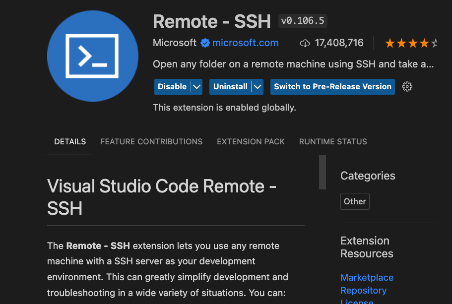
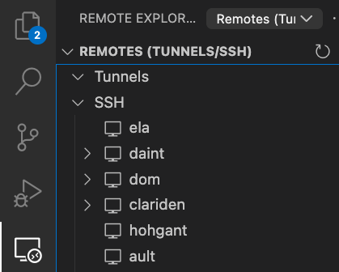

# SSH and VS Code Setup

## SSH Configuration

For passwordless access to the CSCS machines, we configure SSH in our local machines with the keys MFA tools. We need to add some more configuration information in our `~/.ssh/config` file.

We configure for Ela which is CSCS's front-end machine which connects remote users to clusters within the CSCS network.

```bash
Host ela
    HostName ela.cscs.ch
    IdentitiesOnly yes
    User <username>
    IdentityFile ~/.ssh/cscs-key
    ForwardX11 yes
    ForwardX11Trusted yes

Host daint
    HostName daint
    IdentitiesOnly yes
    User <username>
    IdentityFile ~/.ssh/cscs-key
    ProxyJump <username>@ela.cscs.ch
    ForwardX11 yes
    ForwardX11Trusted yes

Host daint*
    User <username>
    ProxyCommand ssh -q -W "%h:%p" ela.cscs.ch

Host nid0*
    User <username>
    ProxyCommand ssh -q -W "%h:%p" daint
```

With this configuration saved, and active SSH keys from the MFA, we can now do `ssh ela` and reach:

```console
➜  .ssh ssh ela
Last login: Thu Jun 22 17:40:02 2023 from 31-10-158-193.cgn.dynamic.upc.ch
  =========================================================================
               IMPORTANT NOTICE FOR USERS of CSCS facilities
      Documentation: CSCS User Portal - https://user.cscs.ch
      Request support: https://support.cscs.ch
  =========================================================================


  =========================================================================
               IMPORTANT NOTICE FOR USERS of CSCS facilities
      Documentation: CSCS User Portal - https://user.cscs.ch
      Request support: https://support.cscs.ch
  =========================================================================
```

We should also be able to do the same with `daint`.

Once logged into `ela`, the command `quota` reveals the storage used by the user. From `daint`, the command `accounting` shows the usage of the allocated node hours.

## Visual Studio Code Setup

Install the Remote-SSH extension by Microsoft from the marketplace.



After installation, in the settings, scroll down to the extensions and find the section concerning the one above. There activate the *Remote Server Listen On Socket* setting.


With these settings, on reload one should be able to find the hosts on the *Remote Explorer* on the left hand side.


