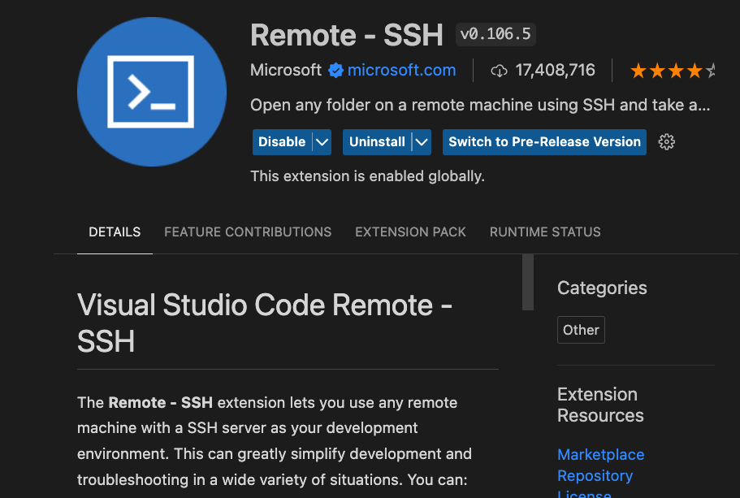
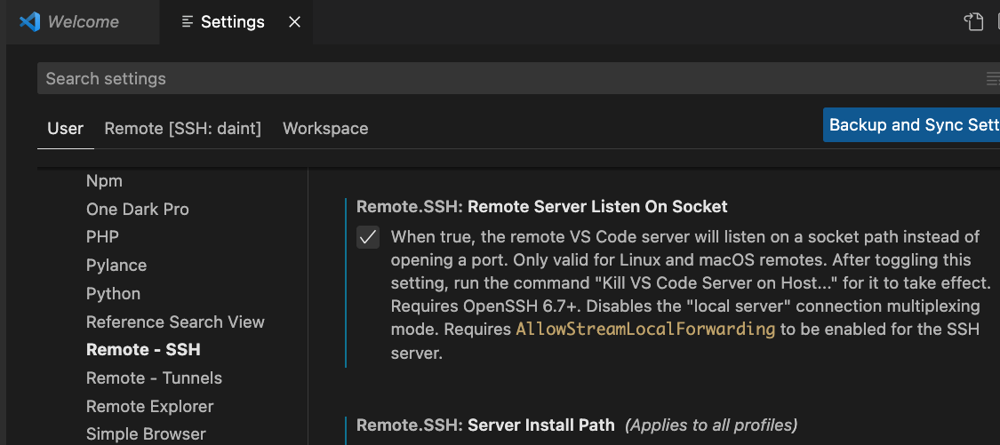
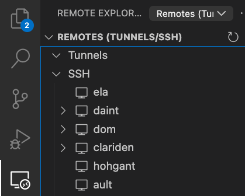
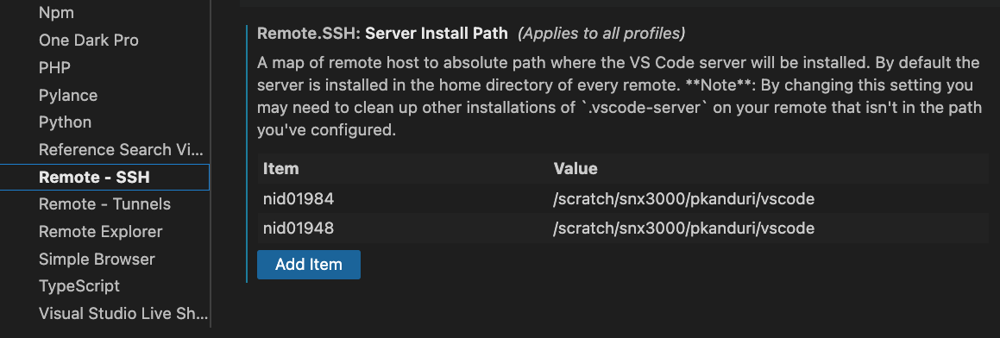

# SSH and Remote IDE Setup for VS Code and PyCharm

## SSH Configuration

For passwordless access to the CSCS machines, we configure SSH in our local machines with the keys configured using the [MFA](https://user.cscs.ch/access/auth/mfa/) tools. We need to add some more configuration information in our `~/.ssh/config` file.

We configure for Ela which is CSCS's front-end machine which connects remote users to clusters within the CSCS network.

```bash
Host ela
    HostName ela.cscs.ch
    IdentitiesOnly yes
    User <username>
    IdentityFile ~/.ssh/cscs-key
    ForwardX11 yes
    ForwardX11Trusted yes

Host daint
    HostName daint
    IdentitiesOnly yes
    User <username>
    IdentityFile ~/.ssh/cscs-key
    ProxyJump <username>@ela.cscs.ch
    ForwardX11 yes
    ForwardX11Trusted yes

Host nid0*
    User <username>
    ProxyCommand ssh -q -W "%h:%p" daint
```

With this configuration saved, and active SSH keys from the MFA, we can now do `ssh ela` and reach:

```console
➜  .ssh ssh ela
Last login: Thu Jun 22 17:40:02 2023 from 31-10-158-193.cgn.dynamic.upc.ch
  =========================================================================
               IMPORTANT NOTICE FOR USERS of CSCS facilities
      Documentation: CSCS User Portal - https://user.cscs.ch
      Request support: https://support.cscs.ch
  =========================================================================


  =========================================================================
               IMPORTANT NOTICE FOR USERS of CSCS facilities
      Documentation: CSCS User Portal - https://user.cscs.ch
      Request support: https://support.cscs.ch
  =========================================================================
```

We should also be able to do the same with `daint`.

Once logged into `ela`, the command `quota` reveals the storage used by the user. From `daint`, the command `accounting` shows the usage of the allocated node hours.

## Visual Studio Code Setup

Install the Remote-SSH extension by Microsoft from the marketplace.



After installation, in the settings, scroll down to the extensions and find the section concerning the one above. There activate the *Remote Server Listen On Socket* setting.



With these settings, on reload one should be able to find the hosts on the *Remote Explorer* on the left hand side.



### Connect VS Code to a Compute Node

Obtain an allocation using `salloc`. That should allocate a compute node with nodeID as `nid0XXXX`.

Now in the VS Code settings, add the nodeID along with a path where one'd like VS Code to start from in the *Server Install Path* panel in the Remote-SSH extension section.



Check in the terminal if `ssh nid0XXXX` works. If yes, then proceed to connect in VS Code using:

`Connect to Host -> nid0XXXX`.


## PyCharm Setup

To use PyCharm Remote Development on Piz Daint, we first launch a remote development server and then connect to it using [these instructions](https://www.jetbrains.com/help/pycharm/2023.2/remote-development-a.html#use_idea).

### Initial Setup

For the initial setup, unpack the PyCharm tar archive on $SCRATCH (on $HOME should work as well), which can be done either on a login node or on a compute node.
```
cd $SCRATCH
mkdir .pycharm/{.cache,.config}
cd .pycharm
# download pycharm-professional-2023.2.3.tar.gz
tar -xf pycharm-professional-2023.2.3.tar.gz
```

### Launch the Remote Development Server

After getting an allocation, launch the remote development server on a compute node (use `export REMOTE_DEV_SERVER_TRACE=1` for debug output). If your Python environment depends on modules, load them before launching the server as PyCharm has no integration for the module system. Note that the `IJ_HOST_CONFIG_BASE_DIR` and `IJ_HOST_SYSTEM_BASE_DIR` environment variables are set to paths under `$SCRATCH`. Also, in the second argument to the development server the project to open is specified.
```
module load ...  # load environment dependencies
IJ_HOST_CONFIG_BASE_DIR=$SCRATCH/.pycharm/.config IJ_HOST_SYSTEM_BASE_DIR=$SCRATCH/.pycharm/.cache pycharm-2023.2.3/bin/remote-dev-server.sh run $SCRATCH/path/to/project/git/repo --ssh-link-host $(hostname) --ssh-link-user $USER --ssh-link-port 22
```

### Connect PyCharm to the Server

Once the server started, return to your local machine and create an SSH tunnel to the compute node using
```
ssh -N -L 5990:localhost:5990 nid0XXXX
```
Now, copy the `tcp://...` address displayed on the compute node into the form below `Connect to Running IDE` under `Remote Development` when you open PyCharm and click `Connect`. That should open the desired project and your previously loaded environment on the compute node should be available.
